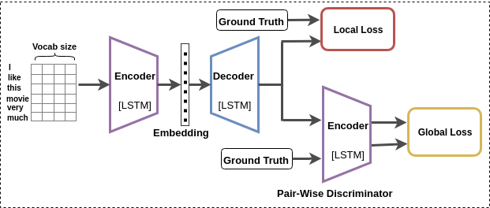

# Awesome-Paraphase Generation

## Dataset

- Question Pairs Dataset -: [[Question Pairs](https://data.quora.com/First-Quora-Dataset-Release-Question-Pairs)]

- Sentiment Analysis with Stanford Sentiment Treebank (SST) Dataset -: [[SST](https://nlp.stanford.edu/sentiment/code.html)]

## Paraphase Question Generation (PQG)
###### Latest papers: 

 - Learning Semantic Sentence Embeddings using Pair-wise Discriminator. [[Paper](http://aclweb.org/anthology/C18-1230)]. [[Code](https://github.com/badripatro/PQG/)] [[Project Link](https://badripatro.github.io/Question-Paraphrases/)]

 
